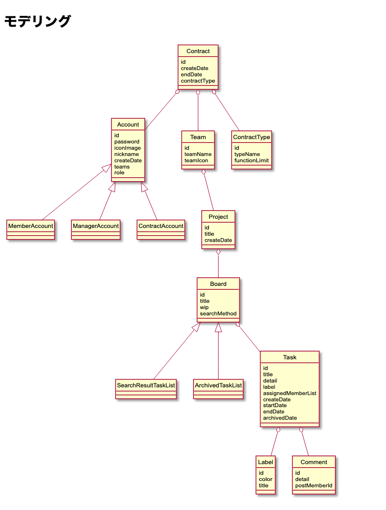
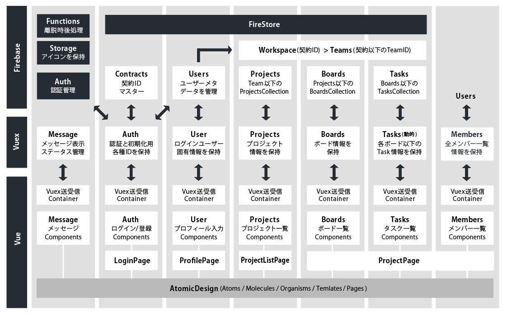

# KANBAN 開発ドキュメント

## 対応環境

* PC Windows10 Edge、Chrome、Firefox最新
* Mac MacOS10.15 Chrome、Firefox、Safari最新
* iPad iOS13 Safari

---

---

## 利用言語/環境

### フロントエンド

* ES6(babel)
* SCSS (CSS Modules)
* node 12.13
  + npm 6.12.0

    - VueCLI 3.11.0
      - vuex
      - webpack
      - babel 
      - eslint
    - Storybook
    - Jest 
    - Firebase

#### バックエンド

* GoogleFirebase
  + FireStore
  + Auth
  + Functions

---

---

## Firebaseデータ設計

### 初期設計



* 法人1契約に対し複数チームをもち、アカウントはどのチームにも属することができるようにする。
* チーム以下に複数プロジェクトがもてる
* プロジェクトの中に ボード/タスク が紐づいている
* 契約による機能制限をつけるため契約タイプが契約に紐づいている
* コメントやラベルをつけることを想定しTaskはLabelとCommnetをhasしている

---

### コレクション設計

#### staticなコレクション

##### contractType

契約種別マスター(今回設計のみ)

``` 
{

    //Collection
    contract_type:{
        //Doc
        free | pro | enterprise:{
            label: String, 
            board_limit: Number (0を無制限とする), 
            member_limit: Number, 
            project_limit: Number, 
            team_limit: Number
        }
    }

}

```

##### labels

カラーラベルマスター(今回設計のみ)

``` 
//Collection
{

    //Doc
    labels:{
        colors:{
            色名：String (16進数)
        }
    }

}
```

##### roles

役割名マスター

``` 
{

    //Collection
    roles:{
        //doc
        contractor | manager | member:{
            label: String（表示ロール名）
        }
    }

}

```

---

#### 契約単位のコレクション

##### users

ユーザーマスター(認証されたユーザーのメタデータを管理)

``` 
{

    //Collection
    users:{
        //Doc
        ユーザーuid:{
            altid: String (乱数-サービスに直接ユーザーuidを出さないための措置), 
            role: String (contractor | manager | member), 
            contracts:{
                //1契約内の複数チームに所属できる
                contractId:[teamId, teamId]
            }, 
            img: Boolean (アイコン画像の有無)
            nickname: String, 
            //ユーザーが脱退しても担当タスクに名前は残すため削除フラグ
            is_deleted: Boolean
        }
    }

}

```

##### workspace

アプリデータの管理

* (c) Collection
* (d) Doc

``` 
(c) workspace/ 

    (d) contractUid/  
        (c) teams/
            (d) teamUid/
                (c) projects/
                    (d) projectUid/
                        (c) boards/
                            (d) boardUid/
                                (c) tasks/
                                    (d) taskUid

```

##### 各ドキュメントフィールド

###### contracts

``` 
{

    //Collection
    workspace:{
        //Doc
        contractUid:{
            contract_type: String (契約種別名)
            limit: TimeStamp (契約期限)
        }
    }

}
```

###### teams

``` 
{

    //Collection
    teams:{
        //Doc
        teamUid:{
            label: String (チーム名)
        }
    }

}
```

###### projects

``` 
{

    //Collection
    projects:{
        //Doc
        projectUid:{
            id: String, 
            label: String, （プロジェクト名）
            order: Number, (並び順)
            update_date: Number (unix時間)
        }
    }

}
```

###### boards

``` 
{

    //Collection
    boards:{
        //Doc
        boardsUid:{
            id: String, 
            label: String, （ボード名）
            order: Number, (並び順)
        }
    }

}
```

###### tasks

``` 
{

    //Collection
    tasks:{
        //Doc
        tasksUid:{
            id: String, 
            data: String, （本文）
            order: Number, (並び順)
            members:[memberAltId], (アサインメンバー)
            editing: String, (編集ロックのための編集者id)
            create_user: String, (作成者id)
            start_date: Number, (unix時間)
            end_date: Number, (unix時間)
            editing_date: Number, (unix時間)
            archive_date: Number, (unix時間)
            comments: Array (コメント機能を想定)
        }
    }

}
```

---
---

## データシーケンス

### 初期生成フロー

今回はデモのため以下登録フローは想定のみとする

#### 契約登録して契約Idと初期チームIdを発行する

1. 契約者ユーザーが契約情報を入力
1. 契約者ユーザーがアカウント情報入力
1. 契約者を初期ユーザーとして登録
1. FirebaseAuth側でユーザーが登録される -> user_uid発行

1.workspace/ にドキュメントを自動IDで作成
1.workspace/contract_uid を契約IDとする
1.つづけて workspace/contract_uid/teams/ に自動IDでドキュメント作成
1.workspace/contract_uid/teams/team_uid を初期チームIDとする

#### 初期データ作成

1. 初期プロジェクトデータを team_uid/projects以下に作成

#### 契約者ユーザーと契約・チームの紐付け

1.usersにuser_uidのドキュメントを作成する
1.users/user_uid のフィールドにcontract_uidとteam_uidを登録

---

### ユーザー登録フロー

今回はデモのため以下登録フローは想定のみとする

1. 契約者ユーザーは新規ユーザーを登録する
1. FirebaseAuth側でユーザーが登録される -> user_uid発行

1.users/user_uidをドキュメントとしてデータを追加
1.contract_uid と team_uidを該当users/user_uidに登録

### ユーザーログインフロー

1.ユーザーはログインする

1. 認証完了 -> user_uid 取得

1.usersをuser_uidでひいて、contract_uidとteam_uid特定
1.workspaceをcontract_uidで参照する
1.workspace/contract_uid/teams/team_uidでprojectsリストを取得して画面を展開する

  + デモバージョンではクライアント側で静的にcontract_uidとteam_uidをもつ

---

---

## Vue構成

### 命名規則・フォーマット

* パスカルケース
  + コンポーネント名・コンポーネントファイル名

* ケバブケース
  + コンポーネントフォルダ名
  + コンポーネントプロパティ(受け渡し側)、イベント名
  + ルーターパス

* キャメルケース
  + プロパティ(受け取り側data)・変数・関数名
  + プライベート関数には$_をつける

``` 
/app/my-project/:project-id
components/user-list/index.vue

<template>
<UserListItem my-prop="" @click="this.$emit('click-on-button')" @enter="onEnter" />
</template>
<script>
import UserListItem from "./user-list-item/"; 
export default {

    name:"UserList", 
    props: {
        firstName: String
        lastName: String
    }, 
    methods:{
        changeList:function(myName){
              let currentData = myName; 
        }, 
        $_changeList:function(){}, 

  }, 
  components:{UserListItem}
}
</script>
```

* フォーマット
  + 4タブスペース
  + フォーマッタ：Prettier

``` 
{

    "printWidth": 100,
    "tabWidth": 4,
    "jsxBracketSameLine": true

}
```

---

## ディレクトリ構成

```
├── dist  
├── public
├── functions(Firebase)
├── tests(Jest)
├── doc
├── .storybook
├── node_modules  
├── package.json   
├── src  
│   ├── components(プレゼンテーショナル)  
│   │   ├── atoms  
│   │   ├── molecules  
│   │   ├── organisms  
│   │   ├── pages  
│   │   ├── templates  
│   │   └── scss
│   ├── containers(コンテナ)  
│   ├── router
│   ├── vender(Firebase初期化関連)
│   ├── assets(画像リソース) 
│   ├── main.js   
│   └── store  
│       └── modules  
```

---

---

## ルーター構成

### 実装対象

| 階層 | パス |
| ---- | ---- |
| サイトトップ | / |
| アプリ | /app |
| 登録・ログイン画面 | /app/login |
| プロジェクト一覧画面 | /app/project |
| プロジェクト画面 | /app/project/[project-id] |

### 未実装の画面想定

| 階層 | パス |
| ---- | ---- |
| パスワード再発行画面 | /app/pasword_reissue |
| 検索結果画面 | /app/project/[project-id]/search |
| アーカイブ画面 | /app/project/[project-id]/archive |
| タスク編集画面 | /app/project/[project-id]/[task-id] |
| マスタ一覧系 | ルーターを設定しない |
| 契約管理 | /app/contract |
| メンバー管理 | /app/members |
| アカウント管理 | /app/profile |

---

---

## コンポーネント設計

Storybook参照
https://kanban.technote.work/story/

## コンポーネント・コンテナ・Vuex・Firebaseの対応関係



