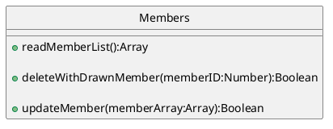

# spec

## 対応環境

- PC Windows10 IE11およびEdge、Chrome、Firefox最新
- Mac MacOS10.15 Chrome、Firefox、Safari最新
- iPad iOS13 Safari
- iPhone iOS13 Safari

---

---

## 利用言語

### フロントエンド

- ES6(babel)
- SCSS (FLOCSS記法)
- VueCLI
- Vuex
- vuex-connect
- Firebase SDK
- npm 6.12.0
	- Webpack
	- babel 
	- Storybook


#### バックエンド

- GoogleFirebase FireStore


---

---

## データ設計

[C] コレクション
[D] ドキュメント
[F] ドキュメントフィールド

### staticなコレクション

#### contractType

契約種別と制限事項のリスト

- [C] contractType
	- [D] id : free | pro | enterprise
		- [F]label:String
		- [F] board_limit:Number (0を無制限とする)
		- [F] member_limit:Number
		- [F] project_limit:Number
		- [F] team_limit:Number
		

#### labels

カラーラベル

- [C] labels
	- [D] id: 欧文色名
		- [F] color: String(十六進数色 #000000)
		- [F] label: String(日本語色名)

#### roles

役割名定数

- [C] roles
	- [D]id: contractor | manager | member
		- [F] label:String (role表示名)

---

### 契約単位のコレクション

#### contracts

契約と、ぶらさがっているユーザーのメタデータを管理する

- [C] contracts
	- [D] contract_id 自動生成されたドキュメントID
		- [F] contract_type:String (契約ID)
		- [F] limit_date:TimeStamp (利用期限)
		- [C] users
			- [D] ユーザーuuid
				- [F] nickname:String
				- [F] role:String (roleID)
				- [F] team_uuids:Array (所属team_uuiIDの配列)
				- [F] isDeleted:Boolean (削除フラグ)


#### workspace

アプリデータの管理

- [C] workspace
	- [D] 契約uuid
		- [C] teams
			- [D] team_id 自動生成されたドキュメントID
				- [F] label:String (チーム名)
				- [C] projects
					- [D] project_id 自動生成されたドキュメントID
					 - [F] label:String（プロジェクト名）
					 - [F] create_date:TimeStamp
					 - [F] update_date:TimeStamp
					 - [C] boards
						- [D] board_id  自動生成されたドキュメントID
						  - [F] label:String（ボード名）
							- [F] wip:Number (制限個数)
							- [C] tasks
								- [D] task_id  自動生成されたドキュメントID
								- [F] data:String（タスク本文）
								- [F] labels:Array（ラベルID配列） 
								- [F] members:Array（割当メンバーuuid配列）
								- [F] create_user:String（制作ユーザーuuid）
								- [F] create_date:TcmeStamp
								- [F] start_date:TimeStamp(作業開始日)
								- [F] end_date:TimeStamp(作業終了日)
								- [F] archive_date:TimeStamp
								- [C] comment
									- [D] comment_id  自動生成されたドキュメントID
										- [F] create_user:String(ユーザーuuid)
										- [F] data:String (本文)
										- [F] update_date:TimeStamp

---

## 初期生成フロー

今回はデモのため以下登録フローは想定のみとする

1. 契約者ユーザーが契約情報を入力する
1. 契約者ユーザーをアカウント登録情報を入力する
1. 契約者を初期ユーザーとして登録する -> user_uuid発行
1. contractsにドキュメントを生成する -> contract_uuid発行
1. contractsに初期ユーザーとして契約者を登録する
1. workspaceにcontract_uuidでドキュメントを作成する
1. workspace/contract_uuid/に teamsコレクションを作成しドキュメントを作成する -> team_uuid発行
1. contracts/users/user_uuid/(契約者) にteam_uuidをわりあてる
1. workspace/contract_uuid/teams/team_uuid/projects/　以下にドキュメントを追加し、初期設定プロジェクトを生成する


---

---

## Vue構成

### 命名規則

- パスカルケース
	- コンポーネント登録名

- ケバブケース
	- コンポーネント名、コンポーネントフォルダ名
	- コンポーネントプロパティ(受け渡し側)、イベント名
	- ルーターパス

```
components:{UserList}
user-list.vue
user-list/index.vue
<user-list my-prop="" @click="this.$emit('click-on-button')"/>
/app/my-project/:project-id
```

- キャメルケース
	- プロパティ(受け取り側data)・変数・関数名
	- プライベート関数には$_をつける

```
export default {
  props: {
    firstName: String
    lastName: String
  },
  methods:{
  	changeList:function(myName){
  	
  		let currentData = myName;
  	},
	$_changeList:function(){},
  }
}
```

- タブは4スペースとする


## ディレクトリ構成

├── dist  
├── node_modules  
├── package.json  
├── src  
│   ├── components(プレゼンテーショナル)  
│   │   ├── atoms  
│   │   ├── molecules  
│   │   ├── organisms  
│   │   ├── pages  
│   │   └── templates  
│   ├── containers(コンテナ)  
│   ├── index.js  
│   └── store  
│	   └── modules  


---

---

## ルーター構成

| 階層 | パス |
| ---- | ---- |
| サイトトップ | / |
| アプリ | /app |
| 新規登録画面 | /app/regist |
| 仮登録完了画面 | /app/complete_regist_temp |
| 登録完了画面/登録失敗画面 | /app/complete_regist |
| ログイン画面 | /app/login |
| パスワード再発行画面 | /app/pasword_reissue |
| パスワードリセット画面 | /app/pasword_reset |
| プロジェクト一覧画面 | /app/project |
| プロジェクト画面 | /app/project/[project-id] |
| 検索結果画面 | /app/project/[project-id]/search |
| アーカイブ画面 | /app/project/[project-id]/archive |
| タスク編集画面 | /app/project/[project-id]/[task-id] |
| マスタ一覧系 | ルーターを設定しない |
| 契約管理 | /app/contract |
| メンバー管理 | /app/members |
| アカウント管理 | /app/profile |


---

---

## コンポーネント設計

### プレゼンテーショナル

#### ***SKIN***

components/themes/properties.css

##### 責務

 - 実際の画面に適用する、CSS変数の値を保持する。

---

#### ***atoms***

components/atoms/ 以下

##### 責務

- それ以上UIとしての機能性を破壊しない最小単位のViewを生成する
- ビジネスロジックは書かない。プロパティをうけてViewを設定し、イベントをあげるだけ。
- 自分の配置情報に関心を持たない

##### 見出し(h1〜h5)

base-heading/index.vue

##### イメージ

base-image/index.vue

##### アイコン

base-icon/index.vue

##### テキスト

base-text/index.vue

##### エディタブルテキスト

base-editable-text/index.vue

##### フォームラベル

base-form-label/index.vue

##### テキストインプット

base-input/index.vue

##### チェックボックス

base-check-box/index.vue

##### セレクトボックス

base-select/index.vue

##### ファイルセレクト

base-file-select/index.vue

##### ボタン

base-button/index.vue

##### リンクボタン

base-link-button/index.vue

##### 時間表記

base-time-text/index.vue

##### モードレスコンテナ

base-modeless-container/index.vue

##### モーダルコンテナ

base-modal-container/index.vue

##### カラーチップ

base-color-chip/index.vue

##### マークダウン描画コンテナ

base-markdown-container/index.vue

---

#### ***molecules***

components/molecules/ 以下

##### 責務

- ユーザーの利用動機を満たすViewを生成する(ラベル+ボタン+フォーム=検索フォーム)
- ビジネスロジックは書かない。プロパティをうけてViewを設定またはv-forなどで生成し、イベントをあげるだけ。
- ビジネスロジックはcontainer側に書く

##### ラベル付きテキストインプット

labeled-input/index.vue


##### フロートメッセージ

float-message/index.vue

##### インラインメッセージ

inline-message/index.vue

##### 確認ダイアログ

confirmation-dialogue/index.vue

##### インプット付き確認ダイアログ

input-confirmation-dialogue/index.vue


##### コンテキストメニュー

context-menu-list/index.vue

##### コンテキストメニューアイテム

context-menu-list-item/index.vue


##### コメントフォーム

comment-form/index.vue

##### カラーラベル

color-label/index.vue

##### アイコン付きテキスト

iconed-text/index.vue


##### アイコン付きテキストボタン

iconed-text-button/index.vue


##### カラーパレットピッカー

color-palette-picker/index.vue


##### カレンダーデータピッカー

calender-data-picker/index.vue
(elementsを使うかも)

##### インプット付きチェックボックス

input-checkbox/index.vue

##### 検索フォーム

search-form/index.vue


---

#### ***organisms***

components/organisms/ 以下

##### 責務

- 独立して成立するコンテンツ単位のViewを生成する
- moleculesやatomsをまとめる
- ビジネスロジックはcontainer側に書く

##### 会員登録フォーム

regist-form/index.vue


##### ログインフォーム

login-form/index.vue

##### プロジェクトサムネール

project-list-item/index.vue

##### プロジェクト一覧

project-list/index.vue

##### クイックエディタ

project-board-quick-editor/index.vue

##### ボード

project-board-list-item/index.vue

##### ボードリスト

project-board-list/index.vue

##### タスク

project-task-list-item/index.vue

##### タスクリスト

project-task-list/index.vue

##### タスク本文

task-info/index.vue

##### タスクコメント

task-comment-list-item/index.vue

##### タスクコメント一覧

task-comment-list/index.vue

##### タスク投稿エディタ

task-post-form/index.vue

##### タスクコメントユニット

task-comment-unit/index.vue

##### タスクラベル

task-label-list-item/index.vue

##### タスクラベル一覧

task-label-list/index.vue

##### タスクメンバー

task-member-list-item/index.vue

##### タスクメンバー一覧

task-member-list/index.vue

##### スケジュール

task-schedule/index.vue

##### ラベルマスター項目

label-master-list-item/index.vue

##### ラベルマスター一覧

label-master-list/index.vue

##### ラベルマスター投稿エディタ

label-master-post-form/index.vue

##### メンバーマスター項目

member-master-list-item/index.vue

##### メンバーマスター一覧

member-master-list/index.vue

##### アーカイブ一覧項目

archive-list-item/index.vue

##### アーカイブ一覧

archive-list/index.vue

##### 検索一覧項目

search-list-item/index.vue

##### 検索一覧

search-list/index.vue


##### メンバー管理項目

manage-member-list-item/index.vue

##### メンバー管理一覧

manage-member-list/index.vue


---

#### ***templates***

components/templates/ 以下

##### 責務

- レイアウトに対しての責務を負う

###### 聖杯レイアウト

holy-grail-layout/index.vue
holy-grail-top/index.vue
holy-grail-bottom/index.vue
holy-grail-main/index.vue
holy-grail-left/index.vue
holy-grail-right/index.vue

###### テーブルレイアウト

table-header/index.vue
table-row/index.vue
table-col/index.vue

###### flexレイアウト

flex-layout/index.vue

###### 左右分配レイアウト

both-side-layout/index.vue
both-side-left/index.vue
both-side-right/index.vue

##### スペーサー

layout-spacer/index.vue

---

#### ***pages***

components/pages/ 以下

##### 責務

ユーザーが使うページ単位をまとめる

##### 新規登録画面

regist-page/index.vue

##### 仮完了登録画面

complete-regist-temp-page/index.vue

##### メール認証画面

complete-regist-page/index.vue

##### ログイン画面

login-page/index.vue

##### パスワード再発行申請画面

password-reissue-page/index.vue


##### パスワード再発行登録画面

password-reset-page/index.vue


##### プロジェクト一覧画面

project-list-page/index.vue


##### プロジェクト編集画面

project-page/index.vue

##### タスク編集画面

task-edit-page/index.vue

##### ラベルマスターページ

label-master-page/index.vue

##### メンバーマスターページ

member-master-page/index.vue

##### カレンダー編集ページ

calender-edit-page/index.vue

##### アーカイブ一覧画面

archive-task-list-page/index.vue

##### 検索結果一覧画面

search-task-list-page/index.vue

##### 契約管理画面

manage-plan-page/index.vue

##### メンバー管理画面

manage-member-page/index.vue

##### プロフィール管理画面

edit-profile-page/index.vue

---
---

### Vuexモジュール

#### Team


#### Projects


#### Boards


#### Tasks


#### Comments


#### TaskLabels


#### TaskMembers


#### MasterLabels


#### MasterMembers



#### 設計除外

以下のユースケースは今回は設計から除外する

- UC-CONTRACT
- UC-MEMBER-MANAGE
- UC-PROFILE


